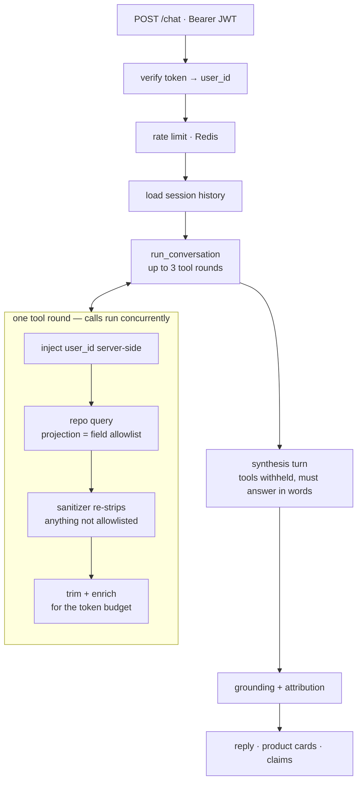

<h1>Conversational Commerce Assistant</h1>

**A read-only AI assistant over a live commerce database — where every price and order ID in an answer is traced back to the query that returned it.**

[](https://github.com/Khatalahmed/conversational-commerce-assistant/actions/workflows/ci.yml)


Shoppers ask things like *"where's my order?"*, *"any blue jackets under ₹2000?"*,
*"can I bargain on this?"* — in an app, in their own words. This service answers
them from live MongoDB through **35 read-only tools**, and never writes anything.

The client sends a message plus the user's existing JWT. Identity comes from that
token and nowhere else: `user_id` does not appear in a single tool schema, so the
model has no vocabulary in which to ask for someone else's data.

> [!NOTE]
> **About this repository.** This is a de-identified version of a system built for
> a client. The platform name, database identifiers, customer records and
> operational documents have been removed or replaced with synthetic equivalents.
> The engineering is unchanged. Published to show how it was built — not licensed
> for reuse.

---

## What it looks like

```bash
curl -X POST localhost:8000/chat \
  -H "Authorization: Bearer $TOKEN" \
  -H "Content-Type: application/json" \
  -d '{"message": "where is my order?", "session_id": "s-1"}'
```

```json
{
  "reply": "Your order ending 4417 is out for delivery — a Cotton Shirt, ₹1,499.",
  "session_id": "s-1",
  "products": [
    { "product_id": "6512c0a4e1b2", "name": "Cotton Shirt",
      "price": 1799, "discountedPrice": 1499, "image": "https://…/shirt.jpg" }
  ],
  "attribution": [
    { "start": 18, "end": 22, "text": "4417",   "kind": "order_suffix", "tool": "get_order_history" },
    { "start": 61, "end": 67, "text": "₹1,499", "kind": "price",        "tool": "get_order_history" }
  ]
}
```

`attribution` is the part worth looking at. Each entry is a character span in the
reply paired with the tool that vouched for it, so a client can underline the
evidence — and anything the model asserted that *no* tool returned is reported
rather than shipped.

<details>
<summary><b>The same answer over Server-Sent Events</b> — <code>POST /chat/stream</code></summary>

<br/>

```
event: status
data: {"tool": "get_order_history", "label": "Looking up your orders"}

event: token
data: {"text": "Your order ending 4417 "}

event: attribution
data: {"claims": [{"start": 18, "end": 22, "text": "4417", "kind": "order_suffix", "tool": "get_order_history"}]}

event: done
data: {"reply": "Your order ending 4417 is out for delivery — a Cotton Shirt, ₹1,499.", "session_id": "s-1"}
```

An answer cannot begin until the lookups finish, so streaming *tokens* does
nothing for the first several seconds. What fills them is the `status` events —
the wait is filled by saying what is being looked up rather than by a spinner.

</details>

---

## The parts worth reading

Most of this is ordinary FastAPI and MongoDB. Four things are not.

### 1. Every claim is traced back to a query

An LLM reading real order data will eventually state a number that came from
nowhere. [`agent/grounding.py`](app/agent/grounding.py) walks the finished reply
against the actual tool payloads and reports what cannot be accounted for: an
order ID no lookup returned, a price matching nothing, a promise to perform an
action the assistant cannot perform.

Attribution uses **character offsets** rather than the matched text, because a
reply saying "₹599" twice would otherwise mark both occurrences from one match.
Only prices and order IDs are attributed — a product *name* cannot be located in
prose without NER, so the honest thing is to mark what can actually be stood
behind.

### 2. Identity is not a model parameter

`user_id` appears in **none** of the 35 tool schemas. The verified JWT subject is
injected server-side in [`agent/tool_executor.py`](app/agent/tool_executor.py).

This is enforced, not documented:
[`test_tool_registry.py`](app/tests/test_tool_registry.py) fails the build on a
schema with no implementation, an implementation with no schema, or any schema
that lets the model name *whose* data it wants.

### 3. The provider chain follows the data

Multi-provider failover is standard advice — until you notice the fallback is the
hole. The primary provider was contractually excluded from training on prompts.
The fallbacks were not. Everything worked perfectly right up to the first rate
limit, at which point failover would have handed real customer records to a
provider permitted to train on them.

Being *first* in a chain is a guarantee about ordering, not about destination. So
the chain is filtered by the data it will carry:

```python
if settings.mongodb_database == settings.production_database_name:
    eligible = tuple(p for p in providers if not p.trains_on_prompts)
```

Point the service at production and non-compliant providers are removed entirely
— it refuses to start rather than degrade unsafely. Point it at the synthetic
dataset and the cheap providers come back. Keyed on the database rather than a
flag, so it cannot be forgotten by whoever deploys next.

> A safety property that only holds while nothing goes wrong is not a safety property.

### 4. Three independent data-safety layers

| Layer | Where |
|---|---|
| Read-only role at the database user — not just in code | infrastructure |
| Field allowlist used as the Mongo **projection**, so disallowed fields never leave the database | [`security/field_allowlist.py`](app/security/field_allowlist.py) |
| An independent sanitizer that re-strips anything not allowlisted, and *raises* on an unknown collection rather than passing it through | [`security/sanitizer.py`](app/security/sanitizer.py) |

Tool results are also treated as data, never instructions — product names,
descriptions and comments are written by sellers and shoppers. See
[`test_prompt_injection.py`](app/tests/test_prompt_injection.py).

---

## How a request flows



**Why a synthesis turn.** The loop appends tool *results* and then re-checks its
condition, so on the final iteration the model never saw what it just asked for —
the query was paid for and then apologised over. Prompting for fewer tool calls
was tried first and measured as useless. Fixing the harness worked: N rounds of
tools, plus a turn to speak.

**Two endpoints, one implementation.** `POST /chat` returns JSON;
`POST /chat/stream` returns SSE. Both call the same `run_conversation` — the only
difference is that the streaming one passes a callback. There is no second
orchestration loop to keep in step, which is the failure mode this shape exists
to avoid.

---

## Layout

```
app/
├── agent/       tool-calling loop, 35 tool schemas, provider client,
│                grounding/attribution, embeddings
├── api/         FastAPI app, /chat + /chat/stream + /health, demo UI
├── config/      settings loader, structured logging with redaction
├── db/          shared async MongoDB and Redis connections
├── evals/       golden-case runner and an LLM judge
├── memory/      per-session conversation history (Redis or in-process)
├── repos/       data access, one file per collection, allowlisted
├── security/    JWT verification, field allowlists, sanitizer, rate limit
└── tests/       526 tests
scripts/         dev-only helpers, not part of the deployed app
```

<details>
<summary><b>Deliberately not reachable from chat</b></summary>

<br/>

Not everything in `repos/` is wired to a tool, and the gaps are choices:

| Code | Why it is not a tool |
|---|---|
| `seller_repo` | The product surface is buyer-side end to end. Four more schemas would be re-sent on every round for a capability nothing reaches. The file documents what wiring it up safely requires — chiefly that `seller_id` must never become a model parameter. |
| `categories_repo` | The assistant needs real category names, but gets them from the system prompt, which is cheaper than a tool round-trip. |

</details>

---

## Running it

```bash
uv sync
cp .env.example .env      # then fill in the values
uv run uvicorn app.api.main:app --reload
```

Interactive docs at `/docs`, a chat surface at `/demo`.

| Variable | Required | Purpose |
|---|:---:|---|
| `MONGODB_URI` | ✅ | Connection string (read-only service account) |
| `JWT_SECRET` | ✅ | Must match the issuing backend's signing secret |
| `LLM_API_KEY` | ✳️ | Primary provider |
| `AZURE_OPENAI_*` | — | Preferred provider; excluded from training on prompts |
| `BACKUP_LLM_*` | — | Any other OpenAI-compatible endpoint |
| `REDIS_URL` | — | Shared session history and rate-limit counts |
| `DEMO_UI_ENABLED` | — | Serves `/demo`. Defaults **true**; set false for anything public |

✳️ at least one provider must be configured.

**Without `REDIS_URL`** the app still starts and answers correctly, but session
history and rate-limit counts are held per process — silently wrong the moment
there is a second worker, since a follow-up landing on another worker reads as a
new conversation and each worker grants the full rate-limit allowance. It
degrades deliberately rather than refusing to start, and logs the consequence at
startup.

---

## Tests

```bash
uv run pytest                    # all 526
uv run pytest -m "not needs_db"  # the 410 that need no database
```

The `needs_db` marker is applied automatically by `conftest.py` to anything
requesting the `db` fixture — derived rather than written by hand, so it cannot
drift as tests are added. CI runs the hermetic subset plus a container build; it
cannot run the rest, because the database allow-lists IP addresses and CI runners
have none.

**The hermetic 410 are not the leftovers.** They are the security invariants, the
provider-selection rules, the rate limiter on both backends, the streaming
transport, log redaction and the tool-surface checks — the places where a
regression is silent.

There is also an eval suite with an LLM judge ([`app/evals/`](app/evals)) scoring
answers on whether they looked in the right place, invented nothing, and promised
nothing they cannot do. Results are compared run over run.

---

## Deployment

```bash
docker build -t commerce-assistant .
```

~270MB, unprivileged user, no `.env` or dev scripts inside — CI asserts all
three. See [docs/deployment.md](docs/deployment.md) for configuration, why
`WEB_CONCURRENCY` defaults to 1, and how to read `/health`.

---

## License

None. Published for demonstration; all rights reserved.
